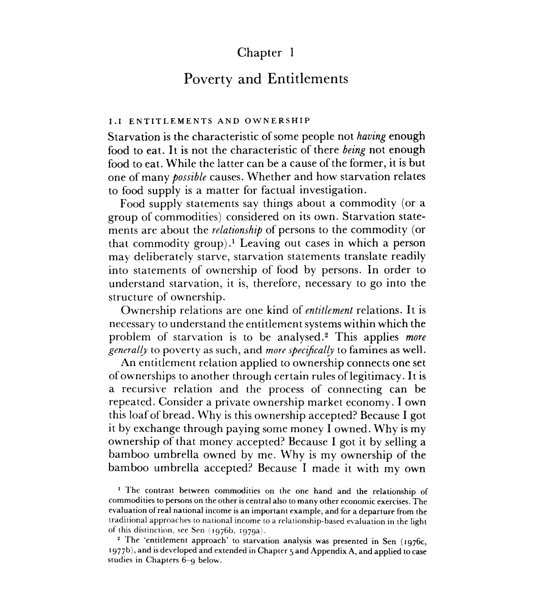
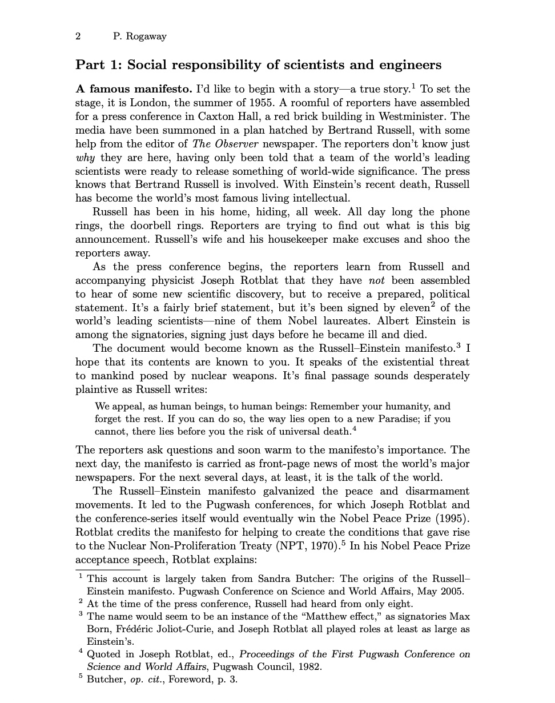

# make-doc-listenable

The goal of this project is to convert pdfs to a format that is listenable by a screen reader or text to speech engine. It cleans out references, headers and footers, and outputs pdfs to a text file, which can then be listened to with say Speechify or say Apple's TTS Engine.

# Requirements

## Mac

1. Install poppler with homebrew - `brew install poppler`.
2. Package requirements - `pip install -r requirements.txt`.
3. Add in your OpenAI API key to your environment and make sure you have credits.
I simply add the following line to my `.bashrc`: `export OPENAI_API_KEY=<your api key>`.
See [this link](https://help.openai.com/en/articles/4936850-where-do-i-find-my-secret-api-key) for more information.
4. If you want output pdf as well, install pandoc - `brew install pandoc`.
   
The install steps should be similar for other operating systems, but I have not tested them.

# Running
1. Setup your configs in `run_config.py`. The variable names are self explanatory.
2. Run `python clean_pdf.py` to clean the pdfs and output the text files.

# Example

## Book

Here is a screenshot of the page of a book, which is in pdf format.



Here is the text output towards of page 10 of the pdf (not of the book).
```
Chapter 1¬                                                                                                                                                                                                                                                   
Poverty and Entitlements¬                                                                                                                                                                                                                                    
¬                                                                                                                                                                                                                                                            
I.I ENTITLEMENTS AND OWNERSHIP¬                                                                                                                                                                                                                              
Starvation is the characteristic of some people not having enough food to eat. It is not the characteristic of there being not enough food to eat. While the latter can be a cause of the former, it is but one of many possible causes. Whether and how starvation relates to food supply is a matter for factual investigation.¬                                                                                                                                                                                        
Food supply statements say things about a commodity (or a group of commodities) considered on its own. Starvation statements are about the relationship of persons to the commodity (or that commodity group). Leaving out cases in which a person may deliberately starve, starvation statements translate readily into statements of ownership of food by persons. In order to understand starvation, it is, therefore, necessary to go into the structure of ownership.¬                                               
Ownership relations are one kind of entitlement relations. It is necessary to understand the entitlement systems within which the problem of starvation is to be analysed. This applies more generally to poverty as such, and more specifically to famines as well.¬                                                                                                                                                                                                                                                     
of legitimacy. It is a recursive relation and the process of connecting can be repeated. Consider a private ownership market economy. I own this loaf of bread. Why is this ownership accepted? Because I got it by exchange through paying some money I owned. Why is my ownership of that money accepted? Because I got it by selling a bamboo umbrella owned by me. Why is my ownership of the bamboo umbrella accepted? Because I made it with my own¬ 


 PAGE 10 ENDS


Poverty and Famines

labour using some bamboo from my land. Why is my ownership
of the land accepted? Because I inherited it from my father. Why
```

## Paper

Here is a screenshot of the page of a paper, which is in pdf format.



Here is the text output towards the end of page 1 of the pdf (not of the paper).

```
The reporters ask questions and soon warm to the manifesto’s importance. The
next day, the manifesto is carried as front-page news of most the world’s major
newspapers. For the next several days, at least, it is the talk of the world.
The Russell–Einstein manifesto galvanized the peace and disarmament
movements. It led to the Pugwash conferences, for which Joseph Rotblat and
the conference-series itself would eventually win the Nobel Peace Prize (1995).
Rotblat credits the manifesto for helping to create the conditions that gave rise
to the Nuclear Non-Proliferation Treaty (NPT, 1970). In his Nobel Peace Prize
acceptance speech, Rotblat explains:


 PAGE 1 ENDS


From my earliest days I had a passion for science. But science, the exercise of the supreme power of the human intellect, was always linked in my mind with benefit to people. I did not imagine that the second half of my life would be spent on efforts to avert a mortal danger to humanity created by science.
```

See example full text output in the `examples` folder. The source pdf for this example is [this Amartya Sen book](https://www.google.com/books/edition/Poverty_and_Famines/FVC9eqGkMr8C).

This software was made initially for treehacks 2023 hosted at Stanford University. See [video demo](https://www.youtube.com/watch?v=c56qSiLCR6k&ab_channel=AyushKanodia).

## Future Work

- [ ] Multiple sequential cleanings to remove headers too.
